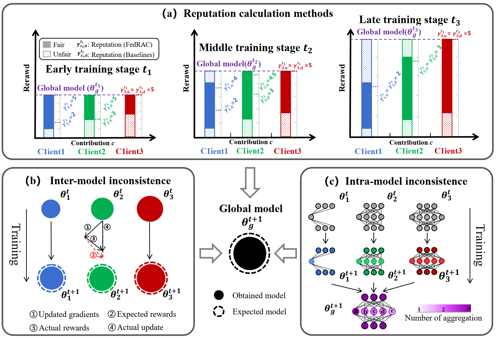
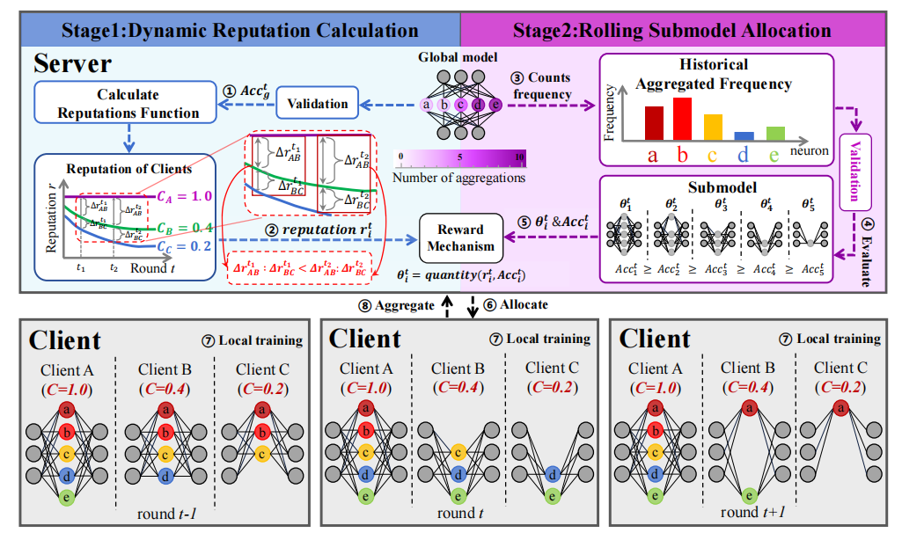
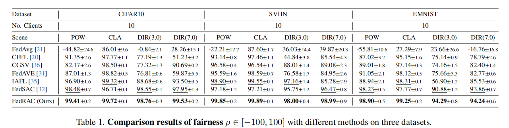
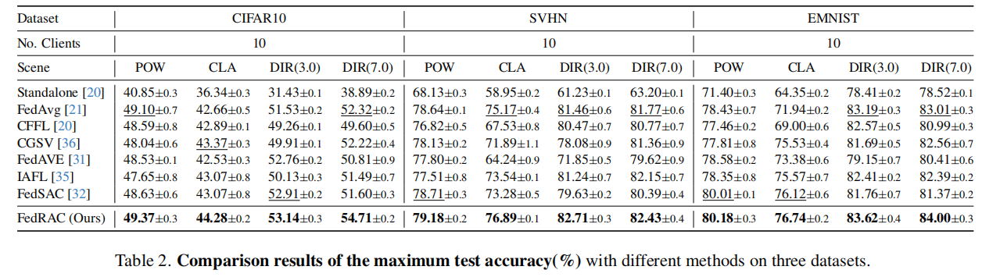
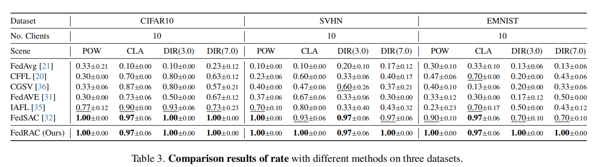
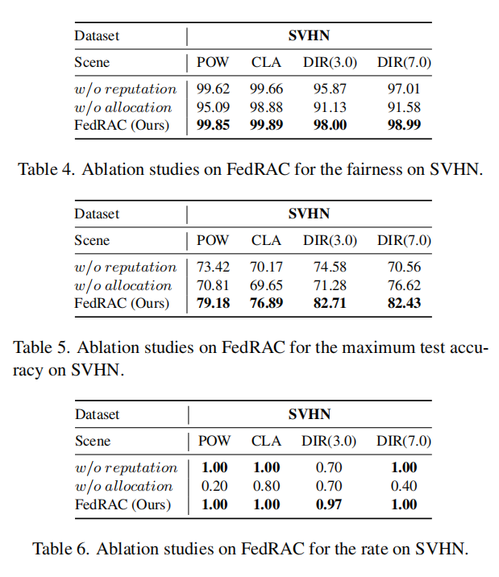

# FedRAC: Rolling Submodel Allocation for Collaborative Fairness in Federated Learning

This is the official implementation of the CVPR 2026 paper [FedRAC: Rolling Submodel Allocation for Collaborative Fairness in Federated Learning](http://arxiv.org/abs/xxx).
## Abstract
Collaborative fairness in federated learning ensures that clients are rewarded according to their contributions, thereby fostering long-term participation among clients. However, existing methods often under-reward low-contributing clients in the early training stage and neglect critical issues (consistency across local models or unequal neuron training frequencies in the global model), leading to degraded performance.
1. Existing methods assign fixed reputation weights to clients throughout training, under-rewarding low-contribution clients in the early stages;
2. Gradient-based methods fail to maintain consistency across local models;
3. Submodel-based methods cause unequal training frequencies for neurons in the global model.

## Overview
The overall framework of FedRAC that achieves α-BCF by maintaining consistency across local models. FedRAC consists of two module: 
1. **Dynamic Reputation Calculation** module computes real-time client reputations by integrating local performance and global model progress, enabling accurate contribution-aware incentives; 
2. **Rolling Submodel Allocation** module maintains a historical neuron aggregation frequency table and prioritizes low-frequency neurons when constructing submodels. It then assigns high-performance submodels to high-reputation clients, ensuring both inter-model consistency (aligned update directions) and intra-model consistency (balanced neuron training), while significantly improving overall model performance.

## Experiments

### Requirements
```
python==3.10.0
flgo==0.0.15				
matplotlib==3.5.3			
numpy==1.23.5			
pandas==2.3.3		
prettytable==3.16.0			
PyYAML==6.0.3			
scipy==1.7.3			
tensorboard==2.11.2			
torch==2.5.0+cu124		
torchvision==0.20.0+cu124	
```

### Select training task
1. Please modify the `task = './my_task/SVHN_POW'` statement in the main function according to the task name.
2. Please modify the `benchmark` option in the main function according to the dataset name.
3. Please modify the `partitioner` option in the main function according to the experimental scenario of the dataset.

### Experimental scenarios
Please navigate to the folder containing the main function and run the code.

1.POW
```shell
python main.py --num_rounds 100000 --batch_size 32 --num_steps 1 --learning_rate 0.03 --seed 0 --eval_interval 1 --clip_grad 1
```

2.CLA
```shell
python main.py --num_rounds 100000 --batch_size 32 --num_steps 5 --learning_rate 0.03 --seed 0 --eval_interval 1 --clip_grad 1
```

3.DIR(3.0)
```shell
python main.py --num_rounds 100000 --batch_size 32 --num_steps 10 --learning_rate 0.03 --seed 0 --eval_interval 1 --clip_grad 1
```

4.DIR(7.0)
```shell
python main.py --num_rounds 100000 --batch_size 32 --num_steps 5 --learning_rate 0.03 --seed 0 --eval_interval 1 --clip_grad 1
```

### Results
We conducted the experiment in four parts:
1. Fairness:

2. Test accuracy:

3. Rate:

4. Ablation study:



## Citation
If you find our paper useful, please cite the paper:
```
XXX
```
